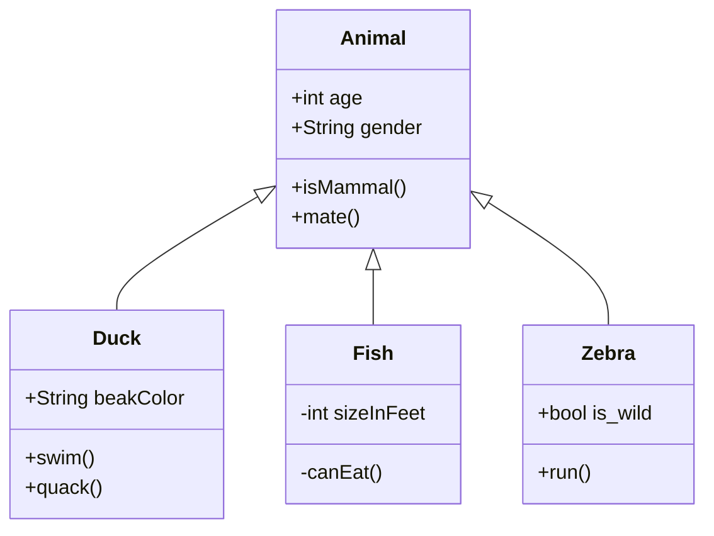
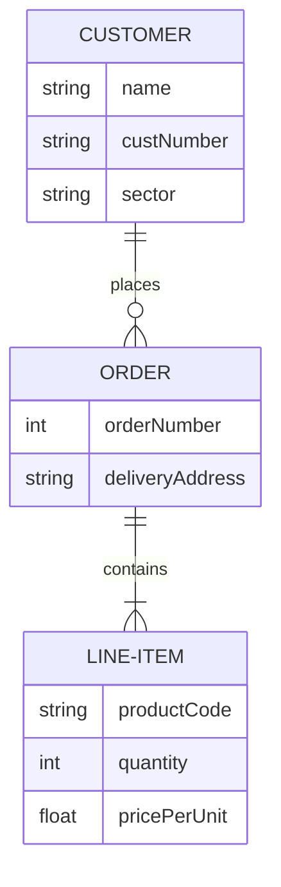
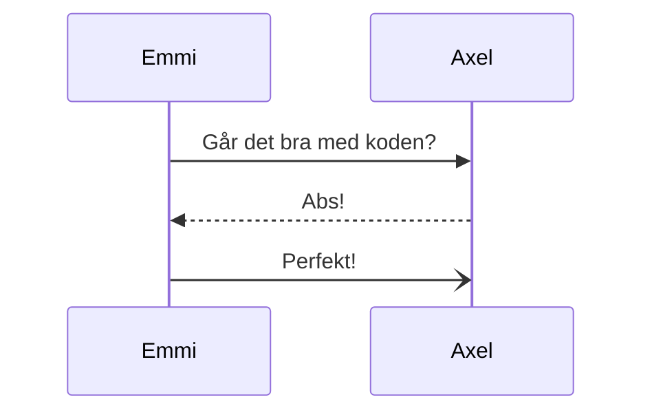

# ProjectX

_Userstory 001_
``` js
function Hello() {
alert("Hello!")
}
```
_Userstory 002_
``` java
something with  java
```

_Userstory 003_


_Userstory 004_
``` js
const house = "This is a house";

```
_Userstory 006_
```
| Name     |      Age      |  Cool |
|----------|:-------------:|------:|
| Emmi     |     100       | 100%  |
| Axel     |     100       | 100%  |
```

_Userstory 005_
[I'm an inline-style link](https://www.google.com)


_Userstory 008_

:neckbeard:


_Userstory 007_  
*This is italic with asterix* and  
_This is italic with underlines_


**This is bold with asterix** and  
__This is bold with underline__

_Userstory 010_
```
1. Emmi
2. Axel
3. Lol
```
```
- Emmi
- Axel
- Lol
```
_Userstory 009_
<hr style="width:50%;text-align:left;margin-left:0">

_Userstory 011_
> Det här är ett blockquote

_Userstory  013_


_Userstory 012_


_Userstory 015_
<mark>
The purpose of living is to have a ==healthy, happy==, and a ==cheerful== life.  
</mark>


_Userstory 016_

